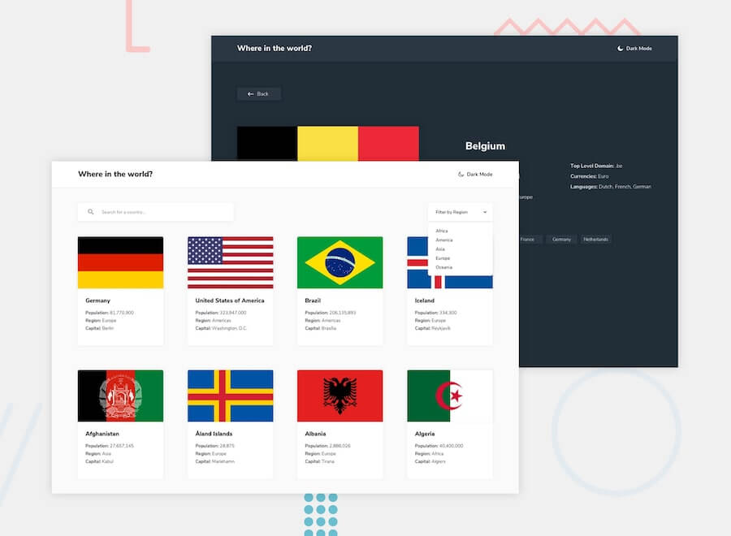
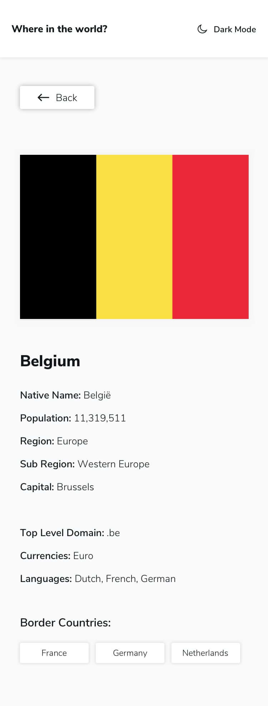

# Frontend Mentor - REST Countries API with color theme switcher solution

This is a solution to the [REST Countries API with color theme switcher challenge on Frontend Mentor](https://www.frontendmentor.io/challenges/rest-countries-api-with-color-theme-switcher-5cacc469fec04111f7b848ca). Frontend Mentor challenges help you improve your coding skills by building realistic projects.

## Table of contents

- [Overview](#overview)
  - [The challenge](#the-challenge)
  - [Screenshot](#screenshot)
  - [Links](#links)
- [My process](#my-process)
  - [Built with](#built-with)
- [Author](#author)
- [Acknowledgments](#acknowledgments)

## Overview

### The challenge

Users should be able to:

- See all countries from the API on the homepage
- Search for a country using an `input` field
- Filter countries by region
- Click on a country to see more detailed information on a separate page
- Click through to the border countries on the detail page
- Toggle the color scheme between light and dark mode _(optional)_

### Screenshot




### Links

- Solution URL: [https://github.com/ErysCode7/countries-api](https://github.com/ErysCode7/countries-api)
- Live Site URL: [https://countries-api-black-psi.vercel.app/](https://countries-api-black-psi.vercel.app/)

1. Clone the repo

   ```sh
   git clone git@github.com:ErysCode7/countries-api.git
   ```

2. Install NPM packages

   ```sh
   npm install
   ```

3. Run app

   ```sh
   npm start
   ```

## My process

### Built with

- [React](https://reactjs.org/) - JS library
- Tailwind CSS
- Axios
- Mobile-first workflow
- Context API
- React Router DOM
- REST Countries API

## Author

- Facebook - [Erys Mozo](https://web.facebook.com/erys.mozo/)
- Instagram - [\_erysmozo](https://www.instagram.com/_erysmozo/)
- Frontend Mentor - [ErysCode7](https://www.frontendmentor.io/profile/ErysCode7)
- LinkedIn - [Erys Mozo](https://www.linkedin.com/in/erys-mozo-280190230/)

## Acknowledgments

I acknowledge myself that I can build these amazing things. Hoping to improve and learn better.
